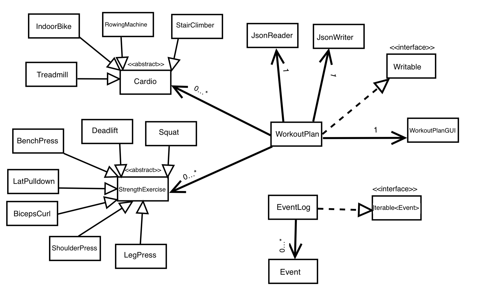

# Workout and Calorie Tracker 

This application creates workout programs and tracks burned
calories using that program. This application is useful for people who are **working out**
regularly to *track their calories*.

## User Stories
     
- As a user, I want to be able to track total calories burned of a workout plan.

- As a user, I want to combine weight and cardio workouts in a single plan.
- As a user, I want to create a list of all my exercises.
- As a user, I want to add or remove the same exercise as much as I want.
- As a user, I want to save my workout plan to use later.
- As a user, I want to load my saved workout plan and edit it.

## Instructions for Grader

- You can add a strength exercise by selecting an exercise from combo boxes and
typing in values for all three of the text fields.
- You can add a cardio by selecting a cardio from the cardio combo box and typing in values for level and minutes
text fields. NOTE: In order to make the program work properly, intensity box needs to be non-empty, even though it is
not taken into calculation.
- You can save the workout plan by clicking the "Save to file" button.
- You can load the workout plan by clicking the "Load from file" button.
- You can print the workout plan by clicking "Print" button.
- You can clear the log by clicking the "Clear" button. It does not remove any exercises from the list.
- You can select an exercise from the "Remove" menu and press "Remove" button to remove an exercise from the list.

## Example Event Log 

Fri Dec 02 22:01:57 PST 2022
Exercise Deadlift added.

Fri Dec 02 22:02:01 PST 2022
Exercise Lat pulldown added.

Fri Dec 02 22:02:03 PST 2022
Saved plan to./data/workoutplan.json

Fri Dec 02 22:02:05 PST 2022
Exercise Deadlift added.

Fri Dec 02 22:02:05 PST 2022
Exercise Lat pulldown added.

Fri Dec 02 22:02:05 PST 2022
Plan loaded from file./data/workoutplan.json

Fri Dec 02 22:02:07 PST 2022
Exercise Deadlift removed.

Fri Dec 02 22:02:07 PST 2022
Printed plan.

Fri Dec 02 22:02:09 PST 2022
Text box cleared.

Fri Dec 02 22:02:11 PST 2022
Saved plan to./data/workoutplan.json

## Phase 4 Task 3:

If I had more time, I would make a better looking GUI by making better combo boxes and make my code
more time efficent. I would handle exceptions better by guiding the user, not only showing an error.